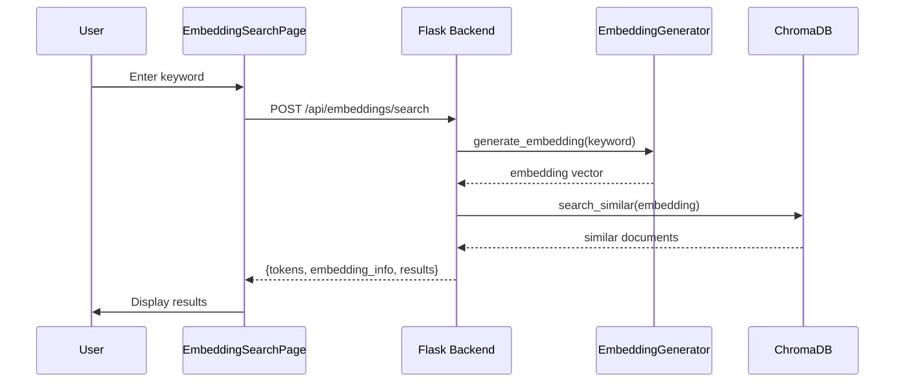

# Embedding Search Page Implementation

## Overview

Create a new frontend page at `/embedding-search` that allows searching the embedding database by keyword. When a user enters a keyword, the system will:

1. Generate an embedding for the keyword using the existing `EmbeddingGenerator`
2. Display tokenization/embedding information (token IDs, words, vector dimensions)
3. Search the vector store for similar documents
4. Display results with similarity scores, content previews, and metadata

## Architecture




## Implementation

### 1. Backend API Endpoint

Add a new endpoint in [`src/backend/api/app.py`](src/backend/api/app.py):

```python
@app.route('/api/embeddings/search', methods=['POST'])
def api_search_embeddings():
    """Search embedding database using a keyword."""
```

This endpoint will:

- Accept JSON body with `keyword` and optional `limit` parameter (default: 10)
- Generate embedding for the keyword using `agent.embedding_generator`
- Search the vector store using `search_similar()`
- Return tokenization info, embedding metadata, and matching documents with scores

### 2. Frontend Page

Create [`src/frontend/src/pages/EmbeddingSearchPage.tsx`](src/frontend/src/pages/EmbeddingSearchPage.tsx):

- Search input with configurable result limit (dropdown: 10/20/50)
- Tokenization display section showing:
- Token IDs (if available from model)
- Words/subwords breakdown
- Embedding vector info (dimension, sample values)
- Results table showing:
- Document filename (clickable link to detail page)
- Categories and sub-categories
- Similarity score (percentage or decimal)
- Content preview
- Loading states and error handling

### 3. Route Registration

Update [`src/frontend/src/App.tsx`](src/frontend/src/App.tsx) to add the new route:

```tsx
<Route path="/embedding-search" element={<EmbeddingSearchPage />} />
```


### 4. Navigation

Update [`src/frontend/src/components/Layout.tsx`](src/frontend/src/components/Layout.tsx) to add navigation link to the new page.

### 5. Types (Already Exists)

The API client already has `searchEmbeddings()` method in [`src/frontend/src/lib/api.ts`](src/frontend/src/lib/api.ts) - will update the return type to include all required fields.

## Key Files to Modify

| File | Change ||------|--------|| `src/backend/api/app.py` | Add `/api/embeddings/search` endpoint || `src/frontend/src/pages/EmbeddingSearchPage.tsx` | New file - search page component || `src/frontend/src/App.tsx` | Add route for new page || `src/frontend/src/components/Layout.tsx` | Add navigation link || `src/frontend/src/types/index.ts` | Add types for search response |

## Notes