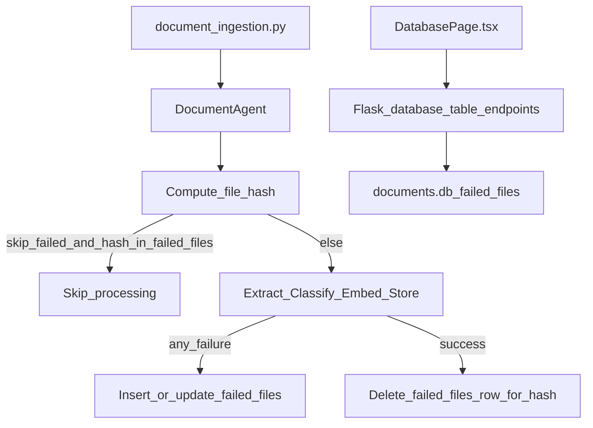

# Failed Files Table + Skip-on-Rerun

### Goal

- Persist ingestion failures in a new SQLite table (file location, hash, failure reason, etc.).
- Add a `document_ingestion.py` flag to **skip files whose `file_hash` exists** in that failed table when rerunning ingestion.
- Ensure the existing Database UI can view + CRUD this table (plus a small UX tweak).

### Key design decisions (based on your answers)

- **Skip matching**: by **`file_hash` only**.
- **Unblock for reprocessing**: **delete the row** (simple CRUD).

### Backend: database schema + helpers

- Update [`/Users/darrenkoh/github/document-management-agents/src/backend/database/database_sqlite_standalone.py`](/Users/darrenkoh/github/document-management-agents/src/backend/database/database_sqlite_standalone.py):
  - Add new table `failed_files` in `_create_tables()`.
  - Proposed columns (all TEXT unless noted):
    - `id INTEGER PRIMARY KEY AUTOINCREMENT`
    - `file_path TEXT`
    - `filename TEXT`
    - `file_hash TEXT UNIQUE` (nullable allowed; skip uses hashes only)
    - `stage TEXT` (e.g. `hash|extract_text|classify|embeddings|db_insert|unknown`)
    - `reason TEXT` (short human reason)
    - `error_type TEXT` (exception class)
    - `error_message TEXT`
    - `failed_at REAL` (unix seconds)
  - Add indexes as needed (unique on `file_hash` is already an index; optionally index `failed_at`).
  - Add helper methods:
    - `record_failed_file(file_path, file_hash, stage, reason, error_type, error_message)`
    - `is_file_hash_failed(file_hash) -> bool`
    - (optional) `clear_failed_file(file_hash)` to remove stale entries after a successful reprocess (I’ll implement this to avoid keeping “failed” rows for files that later succeed).

### Backend: ingestion flow changes (record failures + optional skipping)

- Update [`/Users/darrenkoh/github/document-management-agents/src/backend/core/agent.py`](/Users/darrenkoh/github/document-management-agents/src/backend/core/agent.py):
  - Add `skip_failed: bool = False` to `DocumentAgent.__init__`.
  - In `process_file()`:
    - After computing `file_hash`, if `skip_failed` and `database.is_file_hash_failed(file_hash)` then return a new status like `skipped_failed`.
    - On each failure path (hash failure, empty content, classification failure, embedding failure, unexpected exception), call `database.record_failed_file(...)` with best-available context.
    - On success, call `clear_failed_file(file_hash)` to remove the “failed” marker (so deleting isn’t required when the file is now healthy).
  - Update stats aggregation to include `skipped_failed` (so CLI output is accurate).

### CLI: expose the option in `document_ingestion.py`

- Update [`/Users/darrenkoh/github/document-management-agents/document_ingestion.py`](/Users/darrenkoh/github/document-management-agents/document_ingestion.py):
  - Add `--skip-failed` to `classify` (and optionally `watch`) commands.
  - Wire it into `DocumentAgent(config, verbose=..., skip_failed=args.skip_failed)`.
  - Update the printed summary to include `Skipped (failed)`.

### Backend API + Frontend UI (DatabasePage)

- **Backend API already supports listing tables and CRUD generically**, so `failed_files` will show up automatically once the table exists.
- Update [`/Users/darrenkoh/github/document-management-agents/src/backend/api/app.py`](/Users/darrenkoh/github/document-management-agents/src/backend/api/app.py):
  - Fix CORS `methods` to include **`PUT`** (DatabasePage uses PUT for updates).
- Update [`/Users/darrenkoh/github/document-management-agents/src/frontend/src/pages/DatabasePage.tsx`](/Users/darrenkoh/github/document-management-agents/src/frontend/src/pages/DatabasePage.tsx):
  - Add `failed_at` to the default-sort priority list.
  - Format `failed_at` as a timestamp like `created_at/updated_at/deleted_at`.

### Data flow (high level)

### Acceptance checks

- Ingestion run with `--skip-failed`:
  - A file that failed previously (hash present in `failed_files`) is skipped.
  - A file that failed before but is now fixed can be processed again after deleting its row (and/or automatically cleared on success).
- Database UI:
  - `failed_files` appears in the table list, shows rows, supports create/edit/delete.
  - Editing works from the browser (CORS allows PUT).