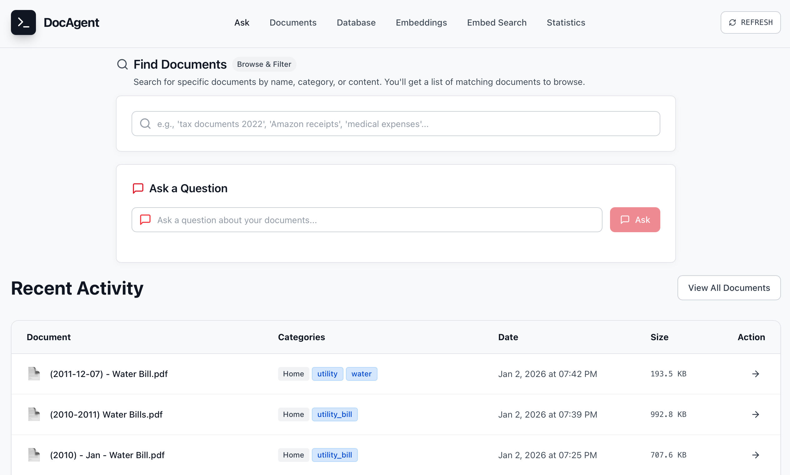
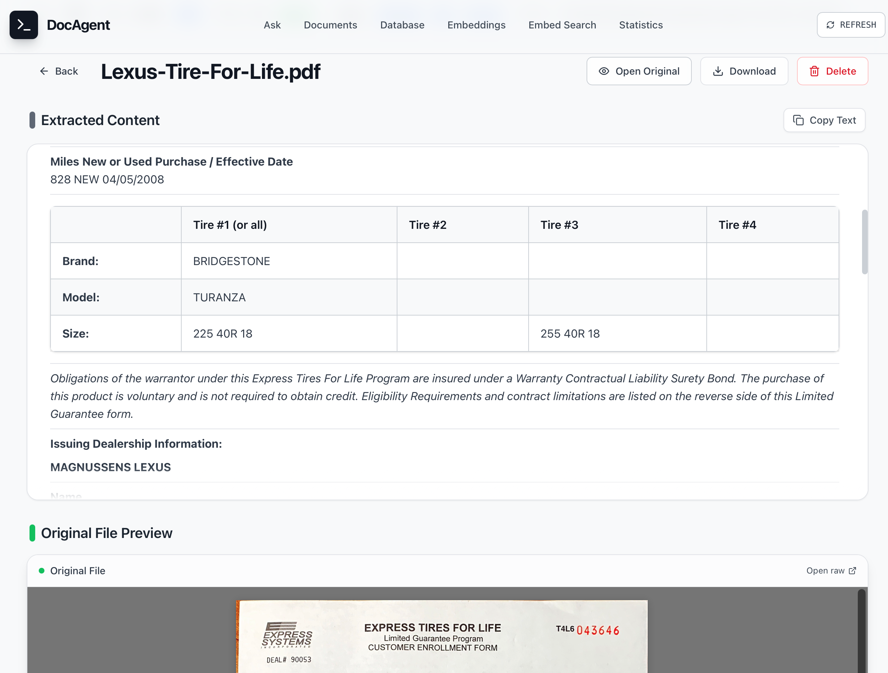
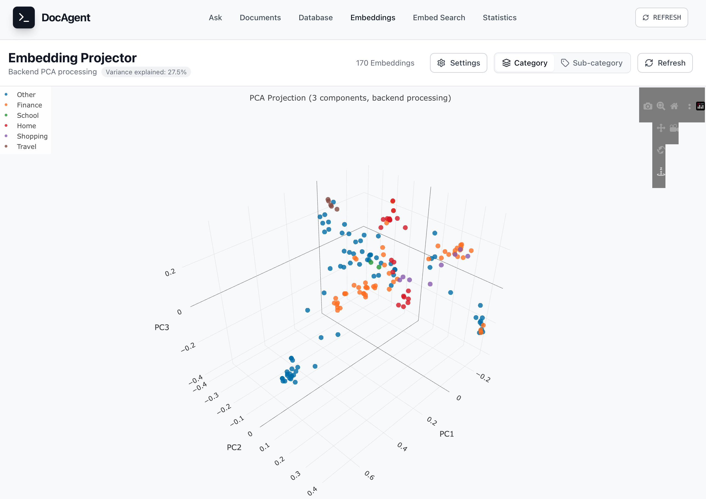
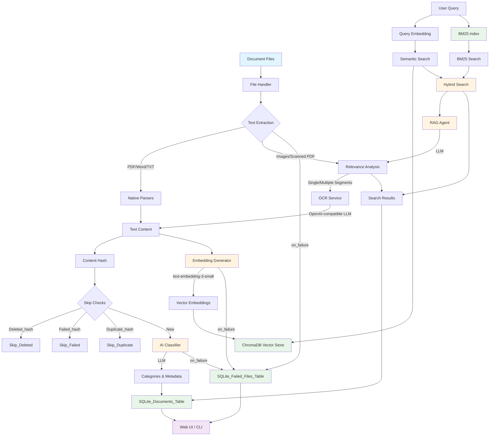

# Document Management Agent

An intelligent document classification and search system that uses **local AI models** to automatically categorize documents, extract text content, and provide semantic search capabilities. All processing runs entirely on your hardware using local LLMs - no cloud dependencies.

## Description

This system automatically processes, classifies, and indexes your documents using local AI services. Here's how it works:

## Quick Start

Get up and running quickly with these steps:

1. **Install dependencies**:
   ```bash
   pip install -r requirements.txt
   cd src/frontend
   npm install
   ```

2. **Configure your system**:
   - Edit `src/backend/config/config.yaml` to set source directories and file types
   - Ensure your LLM server (Ollama, vLLM, etc.) is running with OpenAI-compatible API

3. **Process documents**:
   ```bash
   python document_ingestion.py classify
   ```

4. **View results**:
   - Start backend API: `python src/backend/api/app.py`
   - Start frontend: `cd src/frontend && npm run dev`
   - Open http://localhost:5173 in your browser

## Requirements Overview

### System Requirements

- **Python 3.12+**
- **Node.js 18+** (for frontend)
- **Local LLM server** running with OpenAI-compatible API (Ollama, vLLM, LiteLLM, etc.)
- **Disk space** sufficient for your document database and vector store
- **GPU support** recommended for faster processing (optional but highly beneficial)

### Python Dependencies

Install from `requirements.txt`:
```bash
pip install -r requirements.txt
```

Key dependencies:
- `openai` - OpenAI client for LLM interactions (works with any OpenAI-compatible server)
- `chromadb` - Vector database for embeddings
- `rank-bm25` - BM25 keyword-based search
- `flask` - Web API backend
- `pypdf`, `python-docx` - Document parsers
- `Pillow`, `pdf2image` - Image processing
- `watchdog` - File system monitoring

## Installation

### Backend Setup

1. Clone the repository
2. Install Python dependencies:
   ```bash
   pip install -r requirements.txt
   ```
3. Install the backend dependencies:
   ```bash
   cd src/backend
   pip install -r requirements.txt
   ```

### Frontend Setup

1. Navigate to the frontend directory:
   ```bash
   cd src/frontend
   ```
2. Install Node.js dependencies:
   ```bash
   npm install
   ```

### AI Models

The system works with any OpenAI-compatible LLM server. You can use the same endpoint for all operations, or separate endpoints for different services.

For Ollama, install required models:
```bash
# For Ollama with OpenAI compatibility mode (--enable-openai)
ollama pull gpt-4                 # Document classification
ollama pull text-embedding-3-small # Text embeddings
ollama pull deepseek-ocr:3b       # OCR (optional, if not using Chandra/Hunyuan)
```

## Screenshots

<table>
  <tr>
    <th>Feature</th>
    <th>Screenshot</th>
  </tr>
  <tr>
    <td>Main Page</td>
    <td></td>
  </tr>
  <tr>
    <td>Detail</td>
    <td></td>
  </tr>
  <tr>
    <td>Embedding</td>
    <td></td>
  </tr>
  <tr>
    <td>Embedding</td>
    <td></td>
  </tr>
</table>

### Processing Pipeline

1. **Text Extraction**: Documents are parsed using format-specific libraries (PDF, Word, images). For image-based documents or scanned PDFs, OCR is performed using local AI models (Ollama, Chandra, or HunyuanOCR). Multi-receipt images are automatically segmented using SAM3 (Meta's Segment Anything Model) to separate individual receipts before OCR processing.

2. **Content Hashing**: Each document is hashed (SHA256) to detect duplicates and prevent reprocessing.

3. **AI Classification**: A local LLM (via OpenAI-compatible API) analyzes the document content and filename to assign categories and sub-categories (e.g., "Finance", "Travel", "Shopping").

4. **Semantic Embeddings**: Document content is converted into high-dimensional vectors using a local embedding model (text-embedding-3-small). These embeddings enable semantic search - finding documents by meaning, not just keywords.

5. **Storage**: 
   - **SQLite Database**: Stores document metadata, categories, file paths, and content previews
   - **Failed Files Tracking**: Stores ingestion failures in a `failed_files` table (file path, hash, stage, reason, error details) so you can review and manage failed items from the UI
   - **ChromaDB Vector Store**: Stores embeddings for fast semantic similarity search

6. **Search & Retrieval**: The system uses hybrid search combining:
   - **BM25 keyword search**: Fast keyword-based matching for exact term queries
   - **Semantic search**: Vector similarity matching for conceptual queries
   - Results from both methods are combined with configurable weights
   - An optional RAG (Retrieval-Augmented Generation) agent can further analyze results for relevance

### Local Services Used

- **OpenAI-compatible LLM Server**: Local LLM server (Ollama, vLLM, etc.) for document classification, embeddings, and OCR
- **Chandra/HunyuanOCR** (optional): Alternative OCR engines via vLLM
- **SQLite**: Lightweight database for document metadata
- **ChromaDB**: Vector database for semantic embeddings
- **SAM3** (optional): Meta's Segment Anything Model for intelligent image segmentation. Automatically detects and separates multiple receipts in a single image, enabling individual processing of each receipt before OCR.

All services run locally - your documents never leave your machine.

## Architecture



Document summarization is orchestrated by the `EmbeddingGenerator` (see [src/backend/services/embeddings.py](src/backend/services/embeddings.py)). Summaries are generated without length constraints, allowing the LLM to capture all key information. Token budgets in `llm.summary` control how much output the model can produce before results are persisted in SQLite/ChromaDB.

## Configuration Examples

### Basic Configuration Sample

```yaml
source_paths:
  - "data/input"  # Directory to monitor for documents

file_extensions:
  - ".pdf"
  - ".docx"
  - ".txt"
  - ".png"
  - ".jpg"
  # ... add your file types

llm:
  endpoint: "http://localhost:11434/v1"  # Main LLM endpoint for chat/summarization
  embedding_endpoint: "http://localhost:8080/v1"  # Optional: separate embedding endpoint
  model: "gpt-4"
  embedding_model: "text-embedding-3-small"
  summary:
    initial_num_predict: 4000 # Starting token budget for the summarizer
    incremental_num_predict: 1000 # Tokens added per retry when the model hits limits
```

### Advanced Configuration Sample

```yaml
database:
  path: "data/databases/documents.db"
  vector_store:
    type: "chromadb"
    persist_directory: "data/vector_store"
    dimension: 4096

semantic_search:
  top_k: 30
  min_similarity_threshold: 0.1
  enable_rag: true
  rag_relevance_threshold: 0.3
  enable_bm25: true
  bm25_weight: 0.3
  semantic_weight: 0.7

segmentation:
  enable: true
  checkpoint_path: "~/.cache/huggingface/.../sam3.pt"
  output_dir: "data/segmented_receipts"
  text_prompt: "receipt"
  confidence_threshold: 0.5
  device: "auto"
  model_type: "vit_h"
  min_segment_area: 10000
  overlap_threshold: 0.1

webapp:
  port: 8081
  host: "0.0.0.0"
  debug: true
```

## API Reference

### Document Ingestion API

- `GET /api/documents` - Get all documents
- `POST /api/documents/classify` - Classify documents
- `POST /api/documents/watch` - Start watching for new documents
- `POST /api/search` - Perform search query
- `POST /api/embeddings/reset` - Reset vector embeddings

### Frontend API

- `GET /` - Main application page
- `GET /api/documents/:id` - Get document details
- `GET /api/categories` - Get all categories
- `GET /api/search` - Search documents

## Troubleshooting

### Common Issues and Solutions

#### LLM Connection Issues

**Problem**: `Connection refused` or `Failed to connect to LLM server`

**Solutions**:
- Ensure your LLM server is running with OpenAI-compatible API enabled
- For Ollama: Run with OpenAI compatibility: `ollama serve --enable-openai`
- Check endpoint in `config.yaml` includes `/v1` suffix for OpenAI compatibility
- Verify models are available on your server
- Test connection: `curl http://localhost:11434/v1/models`

#### OCR Not Working

**Problem**: Images/PDFs not extracting text

**Solutions**:
- For Ollama OCR: Install model: `ollama pull deepseek-ocr:3b`
- For Chandra OCR: 
  ```bash
  pip install chandra-ocr
  chandra_vllm  # Starts server on port 11435
  ```
- Check OCR model setting in `config.yaml`: `ocr.ollama.model`
- Verify poppler-utils installed (for PDF processing): `brew install poppler` (macOS) or `apt-get install poppler-utils` (Linux)

### General Debugging

- Enable verbose logging: `python document_ingestion.py --verbose classify`
- Check log file: `data/agent.log`
- Test LLM server directly: `curl -X POST http://localhost:11434/v1/chat/completions -H "Content-Type: application/json" -d '{"model":"gpt-4","messages":[{"role":"user","content":"test"}]}'`
- Verify Python environment: `python --version` (should be 3.12+)
- Check all dependencies: `pip list | grep -E "openai|chromadb|flask"`

## FAQ

### How does the system handle duplicate documents?

Documents are identified by their SHA256 hash. If a document with the same hash is encountered again, it will be skipped during processing to avoid duplication.

### Can I customize the document categories?

Yes, you can customize categories by modifying the classification prompt in `config.yaml`.

### How does semantic search work?

The system uses ChromaDB to store vector embeddings of document content. When performing a search, queries are converted to vectors which are compared to stored embeddings using similarity algorithms.

### What are the requirements for running this system?

You need:
- Python 3.12+
- Node.js 18+
- Local LLM server (Ollama, vLLM, etc.)
- Disk space for database and vector stores
- Optionally, GPU for faster processing

## Contributing

We welcome contributions to this project! Please submit pull requests or issues to our GitHub repository.

## License

This project is licensed under MIT license. See the LICENSE file for details.
