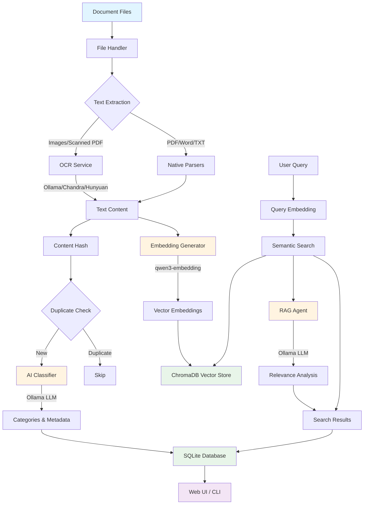

# Document Management Agent

An intelligent document classification and search system that uses **local AI models** to automatically categorize documents, extract text content, and provide semantic search capabilities. All processing runs entirely on your hardware using local LLMs - no cloud dependencies.

## Description

This system automatically processes, classifies, and indexes your documents using local AI services. Here's how it works:

### Processing Pipeline

1. **Text Extraction**: Documents are parsed using format-specific libraries (PDF, Word, images). For image-based documents or scanned PDFs, OCR is performed using local AI models (Ollama, Chandra, or HunyuanOCR).

2. **Content Hashing**: Each document is hashed (SHA256) to detect duplicates and prevent reprocessing.

3. **AI Classification**: A local LLM (via Ollama) analyzes the document content and filename to assign categories and sub-categories (e.g., "Finance", "Travel", "Shopping").

4. **Semantic Embeddings**: Document content is converted into high-dimensional vectors using a local embedding model (qwen3-embedding:8b). These embeddings enable semantic search - finding documents by meaning, not just keywords.

5. **Storage**: 
   - **SQLite Database**: Stores document metadata, categories, file paths, and content previews
   - **ChromaDB Vector Store**: Stores embeddings for fast semantic similarity search

6. **Search & Retrieval**: When you search, your query is converted to an embedding and compared against stored document embeddings. An optional RAG (Retrieval-Augmented Generation) agent can further analyze results for relevance.

### Local Services Used

- **Ollama**: Local LLM server for document classification, embeddings, and OCR
- **Chandra/HunyuanOCR** (optional): Alternative OCR engines via vLLM
- **SQLite**: Lightweight database for document metadata
- **ChromaDB**: Vector database for semantic embeddings
- **SAM3** (optional): Image segmentation for multi-receipt images

All services run locally - your documents never leave your machine.

## Architecture



## Dependencies

### System Requirements

- **Python 3.12+**
- **Node.js 18+** (for frontend)
- **Ollama** installed and running locally

### Python Dependencies

Install from `requirements.txt`:

```bash
pip install -r requirements.txt
```

Key dependencies:
- `ollama` - Ollama client for LLM interactions
- `chromadb` - Vector database for embeddings
- `flask` - Web API backend
- `pypdf`, `python-docx` - Document parsers
- `Pillow`, `pdf2image` - Image processing
- `watchdog` - File system monitoring

### Frontend Dependencies

```bash
cd src/frontend
npm install
```

### AI Models (Ollama)

Install required models:

```bash
ollama pull deepseek-r1:8b        # Document classification
ollama pull qwen3-embedding:8b    # Text embeddings
ollama pull deepseek-ocr:3b       # OCR (optional, if not using Chandra/Hunyuan)
```

### Optional Dependencies

- **SAM3** (for receipt segmentation): Install from [facebookresearch/sam3](https://github.com/facebookresearch/sam3)
- **Chandra OCR**: Install via `pip install chandra-ocr` and run vLLM server
- **HunyuanOCR**: Configure vLLM server with HunyuanOCR model

## How to Run

### 1. Configure the System

Edit `src/backend/config/config.yaml`:

```yaml
source_paths:
  - "data/input"  # Directory to monitor for documents

file_extensions:
  - ".pdf"
  - ".docx"
  - ".txt"
  - ".png"
  - ".jpg"
  # ... add your file types

ollama:
  endpoint: "http://localhost:11434"
  model: "deepseek-r1:8b"
  embedding_model: "qwen3-embedding:8b"
```

### 2. Process Documents

**One-time processing:**
```bash
python document_ingestion.py classify
```

**Continuous monitoring (watch mode):**
```bash
python document_ingestion.py watch
```

**CLI search:**
```bash
python document_ingestion.py search "travel booking"
python document_ingestion.py category invoice
```

### 3. Start Web Interface

**Terminal 1 - Backend API:**
```bash
python src/backend/api/app.py
```

**Terminal 2 - Frontend:**
```bash
cd src/frontend
npm run dev
```

Open http://localhost:5173 in your browser.

## How to Configure/Customize

### Configuration File

Main configuration is in `src/backend/config/config.yaml`:

#### Source Directories
```yaml
source_paths:
  - "data/input"
  - "/path/to/other/directory"
```

#### File Types
```yaml
file_extensions:
  - ".pdf"
  - ".docx"
  # Only files with these extensions will be processed
```

#### Database & Vector Store
```yaml
database:
  path: "data/databases/documents.db"
  vector_store:
    type: "chromadb"
    persist_directory: "data/vector_store"
    dimension: 4096
```

#### AI Models
```yaml
ollama:
  endpoint: "http://localhost:11434"
  model: "deepseek-r1:8b"
  embedding_model: "qwen3-embedding:8b"
  ocr_model: "deepseek-ocr:3b"  # or "chandra" or "hunyuan"
```

#### OCR Configuration
```yaml
# For Chandra OCR (vLLM-based)
chandra:
  endpoint: "http://localhost:11435"
  model: "chandra"

# For HunyuanOCR (vLLM-based)
hunyuan:
  endpoint: "http://localhost:11435"
  model: "tencent/HunyuanOCR"
```

#### Receipt Segmentation (Optional)
```yaml
segmentation:
  enable: true
  checkpoint_path: "~/.cache/huggingface/.../sam3.pt"
  output_dir: "data/segmented_receipts"
  text_prompt: "receipt"
  confidence_threshold: 0.5
```

#### Search Settings
```yaml
semantic_search:
  top_k: 30
  min_similarity_threshold: 0.1
  enable_rag: true
  rag_relevance_threshold: 0.3
```

#### Watch Mode
```yaml
watch:
  interval: 5  # seconds
  recursive: true
  exclude_paths:
    - "data/segmented_receipts"
```

#### Web Server
```yaml
webapp:
  port: 8081
  host: "0.0.0.0"
  debug: true
```

### Custom Categories

Edit the classification prompt in `config.yaml`:

```yaml
prompt_template: |
  You are an expert document classifier...
  Available main categories:
  - Finance
  - Shopping
  - Travel
  # Add your custom categories
```

## Troubleshooting

### Ollama Connection Issues

**Problem**: `Connection refused` or `Failed to connect to Ollama`

**Solutions**:
- Ensure Ollama is running: `ollama serve`
- Check endpoint in `config.yaml` matches your Ollama server
- Verify models are installed: `ollama list`
- Test connection: `curl http://localhost:11434/api/tags`

### OCR Not Working

**Problem**: Images/PDFs not extracting text

**Solutions**:
- For Ollama OCR: Install model: `ollama pull deepseek-ocr:3b`
- For Chandra OCR: 
  ```bash
  pip install chandra-ocr
  chandra_vllm  # Starts server on port 11435
  ```
- Check OCR model setting in `config.yaml`: `ollama.ocr_model`
- Verify poppler-utils installed (for PDF processing): `brew install poppler` (macOS) or `apt-get install poppler-utils` (Linux)

### No Documents Processed

**Problem**: Files in source directory not being processed

**Solutions**:
- Check `file_extensions` in `config.yaml` includes your file types
- Verify `source_paths` point to correct directories
- Check file permissions
- Enable verbose logging: `python document_ingestion.py --verbose classify`
- Review logs: `data/agent.log`

### Slow Processing

**Problem**: Documents taking too long to process

**Solutions**:
- Use GPU acceleration for Ollama (if available)
- Reduce `max_ocr_pages` in config to limit OCR processing
- Use smaller/faster models
- Process in batches (already implemented)
- Disable RAG analysis: `semantic_search.enable_rag: false`

### Frontend Not Loading

**Problem**: Web UI shows errors or won't connect

**Solutions**:
- Ensure backend is running on port 8081: `python src/backend/api/app.py`
- Check CORS settings if accessing from different domain
- Verify frontend dev server is running: `cd src/frontend && npm run dev`
- Check browser console for errors
- Verify API endpoint in frontend config matches backend

### Receipt Segmentation Issues

**Problem**: SAM3 segmentation not working

**Solutions**:
- Ensure SAM3 is installed: `git clone https://github.com/facebookresearch/sam3.git && cd sam3 && pip install -e .`
- Verify `segmentation.checkpoint_path` is set correctly
- On Apple Silicon, use `device: "auto"` or `device: "mps"` for Metal acceleration
- For CPU-only: `device: "cpu"`
- Test standalone: `python src/backend/scripts/segment_receipts.py --input /path/to/image`

### Database/Vector Store Errors

**Problem**: Database corruption or vector store issues

**Solutions**:
- Check disk space
- Verify write permissions on `data/` directory
- Try recreating database (backup first)
- Check ChromaDB logs in `data/vector_store/`
- Ensure embedding dimension matches model output

### General Debugging

- Enable verbose logging: `python document_ingestion.py --verbose classify`
- Check log file: `data/agent.log`
- Test Ollama directly: `ollama run deepseek-r1:8b "test"`
- Verify Python environment: `python --version` (should be 3.12+)
- Check all dependencies: `pip list | grep -E "ollama|chromadb|flask"`

## Screenshots

<!-- Add screenshots here -->
<!-- 
### Dashboard


### Document Browser


### Search Interface


### Document Details

-->
