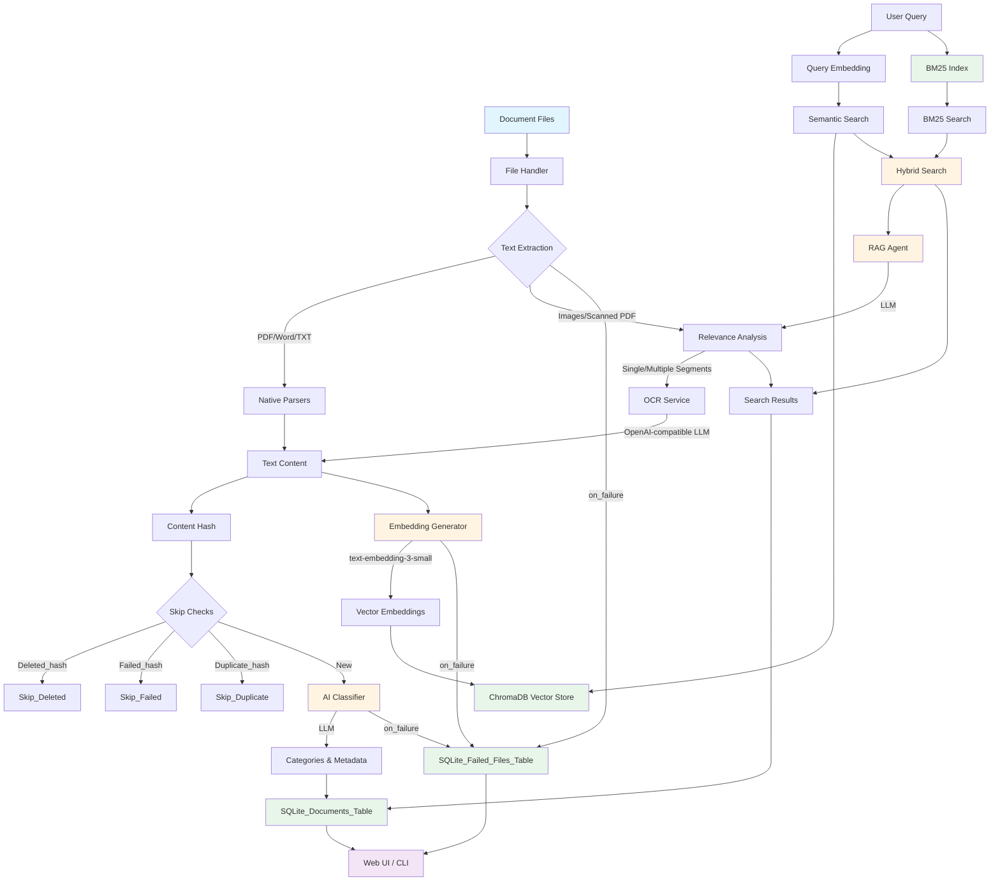

# Document Management Agent

An intelligent document classification and search system that uses **local AI models** to automatically categorize documents, extract text content, and provide semantic search capabilities. All processing runs entirely on your hardware using local LLMs - no cloud dependencies.

## Description

This system automatically processes, classifies, and indexes your documents using local AI services. Here's how it works:

### Processing Pipeline

1. **Text Extraction**: Documents are parsed using format-specific libraries (PDF, Word, images). For image-based documents or scanned PDFs, OCR is performed using local AI models (Ollama, Chandra, or HunyuanOCR). Multi-receipt images are automatically segmented using SAM3 (Meta's Segment Anything Model) to separate individual receipts before OCR processing.

2. **Content Hashing**: Each document is hashed (SHA256) to detect duplicates and prevent reprocessing.

3. **AI Classification**: A local LLM (via OpenAI-compatible API) analyzes the document content and filename to assign categories and sub-categories (e.g., "Finance", "Travel", "Shopping").

4. **Semantic Embeddings**: Document content is converted into high-dimensional vectors using a local embedding model (text-embedding-3-small). These embeddings enable semantic search - finding documents by meaning, not just keywords.

5. **Storage**: 
   - **SQLite Database**: Stores document metadata, categories, file paths, and content previews
   - **Failed Files Tracking**: Stores ingestion failures in a `failed_files` table (file path, hash, stage, reason, error details) so you can review and manage failed items from the UI
   - **ChromaDB Vector Store**: Stores embeddings for fast semantic similarity search

6. **Search & Retrieval**: The system uses hybrid search combining:
   - **BM25 keyword search**: Fast keyword-based matching for exact term queries
   - **Semantic search**: Vector similarity matching for conceptual queries
   - Results from both methods are combined with configurable weights
   - An optional RAG (Retrieval-Augmented Generation) agent can further analyze results for relevance

### Local Services Used

- **OpenAI-compatible LLM Server**: Local LLM server (Ollama, vLLM, etc.) for document classification, embeddings, and OCR
- **Chandra/HunyuanOCR** (optional): Alternative OCR engines via vLLM
- **SQLite**: Lightweight database for document metadata
- **ChromaDB**: Vector database for semantic embeddings
- **SAM3** (optional): Meta's Segment Anything Model for intelligent image segmentation. Automatically detects and separates multiple receipts in a single image, enabling individual processing of each receipt before OCR.

All services run locally - your documents never leave your machine.

## Architecture



Document summarization is orchestrated by the `EmbeddingGenerator` (see [src/backend/services/embeddings.py](src/backend/services/embeddings.py)). Summaries are generated without length constraints, allowing the LLM to capture all key information. Token budgets in `llm.summary` control how much output the model can produce before results are persisted in SQLite/ChromaDB.

## Dependencies

### System Requirements

- **Python 3.12+**
- **Node.js 18+** (for frontend)
- **Local LLM server** running with OpenAI-compatible API (Ollama, vLLM, LiteLLM, etc.)

### Python Dependencies

Install from `requirements.txt`:

```bash
pip install -r requirements.txt
```

Key dependencies:
- `openai` - OpenAI client for LLM interactions (works with any OpenAI-compatible server)
- `chromadb` - Vector database for embeddings
- `rank-bm25` - BM25 keyword-based search
- `flask` - Web API backend
- `pypdf`, `python-docx` - Document parsers
- `Pillow`, `pdf2image` - Image processing
- `watchdog` - File system monitoring

### Frontend Dependencies

```bash
cd src/frontend
npm install
```

### AI Models

The system works with any OpenAI-compatible LLM server. You can use the same endpoint for all operations, or separate endpoints for different services (e.g., embeddings on port 8080, main LLM on port 11434).

For Ollama, install required models:

```bash
# For Ollama with OpenAI compatibility mode (--enable-openai)
ollama pull gpt-4                 # Document classification
ollama pull text-embedding-3-small # Text embeddings
ollama pull deepseek-ocr:3b       # OCR (optional, if not using Chandra/Hunyuan)
```

For other servers (vLLM, LiteLLM, etc.), ensure they provide OpenAI-compatible APIs and the models are available.

**Separate Embedding Endpoint**: If you want to run embeddings on a different server/port, set `embedding_endpoint` in your config. This is useful for load balancing or using specialized embedding servers.

### Optional Dependencies

- **SAM3** (for receipt segmentation): Meta's Segment Anything Model for automatic receipt detection and segmentation. Install via:
  ```bash
  git clone https://github.com/facebookresearch/segment-anything.git
  cd segment-anything
  pip install -e .
  ```
  Requires PyTorch and will automatically download model checkpoints on first use. Supports GPU acceleration on CUDA/MPS devices.
- **Chandra OCR**: Install via `pip install chandra-ocr` and run vLLM server
- **HunyuanOCR**: Configure vLLM server with HunyuanOCR model

## How to Run

### 1. Configure the System

Edit `src/backend/config/config.yaml`:

```yaml
source_paths:
  - "data/input"  # Directory to monitor for documents

file_extensions:
  - ".pdf"
  - ".docx"
  - ".txt"
  - ".png"
  - ".jpg"
  # ... add your file types

llm:
  endpoint: "http://localhost:11434/v1"  # Main LLM endpoint for chat/summarization
  embedding_endpoint: "http://localhost:8080/v1"  # Optional: separate embedding endpoint
  model: "gpt-4"
  embedding_model: "text-embedding-3-small"
  summary:
    initial_num_predict: 4000 # Starting token budget for the summarizer
    incremental_num_predict: 1000 # Tokens added per retry when the model hits limits
```

**Summary generation** for both classification prompts and embedding summaries is unlimited - the LLM writes comprehensive summaries without truncation. Tune the token budgets in `llm.summary` if your model needs more output capacity. All summary requests honor these values before the result is cached in the SQLite metadata table and summarized embeddings stored in ChromaDB.

### 2. Process Documents

**One-time processing:**
```bash
python document_ingestion.py classify
```

**Skip previously-failed files (by file hash):**
```bash
python document_ingestion.py classify --skip-failed
```

**Continuous monitoring (watch mode):**
```bash
python document_ingestion.py watch
```

**Watch mode + skip previously-failed files (by file hash):**
```bash
python document_ingestion.py watch --skip-failed
```

**CLI search:**
```bash
python document_ingestion.py search "travel booking"
python document_ingestion.py category invoice
```

### 3. Start Web Interface

**Terminal 1 - Backend API:**
```bash
python src/backend/api/app.py
```

**Terminal 2 - Frontend:**
```bash
cd src/frontend
npm run dev
```

Open http://localhost:5173 in your browser.

## How to Configure/Customize

### Configuration File

Main configuration is in `src/backend/config/config.yaml`:

#### Source Directories
```yaml
source_paths:
  - "data/input"
  - "/path/to/other/directory"
```

#### File Types
```yaml
file_extensions:
  - ".pdf"
  - ".docx"
  # Only files with these extensions will be processed
```

#### Database & Vector Store
```yaml
database:
  path: "data/databases/documents.db"
  vector_store:
    type: "chromadb"
    persist_directory: "data/vector_store"
    dimension: 4096
```

#### AI Models
```yaml
llm:
  endpoint: "http://localhost:11434/v1"  # Add /v1 for OpenAI compatibility
  model: "gpt-4"
  embedding_model: "text-embedding-3-small"
  ocr_model: "deepseek-ocr:3b"  # or "chandra" or "hunyuan"
```

#### OCR Configuration
```yaml
# For Chandra OCR (vLLM-based)
chandra:
  endpoint: "http://localhost:11435"
  model: "chandra"

# For HunyuanOCR (vLLM-based)
hunyuan:
  endpoint: "http://localhost:11435"
  model: "tencent/HunyuanOCR"
```

#### Receipt Segmentation (Optional)
```yaml
segmentation:
  enable: true                          # Enable/disable SAM3 segmentation for multi-receipt images
  checkpoint_path: "~/.cache/huggingface/.../sam3.pt"  # Path to SAM model checkpoint (auto-downloads if not found)
  output_dir: "data/segmented_receipts"  # Directory to save segmented receipt images
  text_prompt: "receipt"                 # Text prompt for SAM3 to identify receipt regions
  confidence_threshold: 0.5             # Minimum confidence score for segmentation (0.0-1.0)
  device: "auto"                        # Device for SAM3 inference: "auto", "cuda", "mps", or "cpu"
  model_type: "vit_h"                   # SAM model size: "vit_h" (huge), "vit_l" (large), "vit_b" (base)
  min_segment_area: 10000               # Minimum pixel area for a valid receipt segment
  overlap_threshold: 0.1                # Maximum overlap allowed between segments (0.0-1.0)
```

#### Search Settings
```yaml
semantic_search:
  top_k: 30
  min_similarity_threshold: 0.1
  enable_rag: true
  rag_relevance_threshold: 0.3
  # Hybrid search: combine BM25 (keyword) and semantic (vector) search
  enable_bm25: true
  bm25_weight: 0.3      # Weight for keyword matching (0.0-1.0)
  semantic_weight: 0.7  # Weight for semantic similarity (0.0-1.0)
```

#### Watch Mode
```yaml
watch:
  interval: 5  # seconds
  recursive: true
  exclude_paths:
    - "data/segmented_receipts"
```

#### Web Server
```yaml
webapp:
  port: 8081
  host: "0.0.0.0"
  debug: true
```

### Custom Categories

Edit the classification prompt in `config.yaml`:

```yaml
prompt_template: |
  You are an expert document classifier...
  Available main categories:
  - Finance
  - Shopping
  - Travel
  # Add your custom categories
```

## Troubleshooting

### LLM Connection Issues

**Problem**: `Connection refused` or `Failed to connect to LLM server`

**Solutions**:
- Ensure your LLM server is running with OpenAI-compatible API enabled
- For Ollama: Run with OpenAI compatibility: `ollama serve --enable-openai`
- Check endpoint in `config.yaml` includes `/v1` suffix for OpenAI compatibility
- Verify models are available on your server
- Test connection: `curl http://localhost:11434/v1/models`

### OCR Not Working

**Problem**: Images/PDFs not extracting text

**Solutions**:
- For Ollama OCR: Install model: `ollama pull deepseek-ocr:3b`
- For Chandra OCR: 
  ```bash
  pip install chandra-ocr
  chandra_vllm  # Starts server on port 11435
  ```
- Check OCR model setting in `config.yaml`: `ocr.ollama.model`
- Verify poppler-utils installed (for PDF processing): `brew install poppler` (macOS) or `apt-get install poppler-utils` (Linux)

### No Documents Processed

**Problem**: Files in source directory not being processed

**Solutions**:
- Check `file_extensions` in `config.yaml` includes your file types
- Verify `source_paths` point to correct directories
- Check file permissions
- Enable verbose logging: `python document_ingestion.py --verbose classify`
- Review logs: `data/agent.log`

### Slow Processing

**Problem**: Documents taking too long to process

**Solutions**:
- Use GPU acceleration for your LLM server (if available)
- Reduce `max_ocr_pages` in config to limit OCR processing
- Use smaller/faster models
- Process in batches (already implemented)
- Disable RAG analysis: `semantic_search.enable_rag: false`
- Disable BM25 if not needed: `semantic_search.enable_bm25: false` (uses semantic-only search)

### Frontend Not Loading

**Problem**: Web UI shows errors or won't connect

**Solutions**:
- Ensure backend is running on port 8081: `python src/backend/api/app.py`
- Check CORS settings if accessing from different domain
- Verify frontend dev server is running: `cd src/frontend && npm run dev`
- Check browser console for errors
- Verify API endpoint in frontend config matches backend

### Receipt Segmentation Issues

**Problem**: SAM3 segmentation not working

**Solutions**:
- **Installation Issues**:
  - Install SAM3 correctly: `git clone https://github.com/facebookresearch/segment-anything.git && cd segment-anything && pip install -e .`
  - Ensure PyTorch is installed with CUDA support if using GPU: `pip install torch torchvision torchaudio --index-url https://download.pytorch.org/whl/cu118`
  - Check PyTorch installation: `python -c "import torch; print(torch.cuda.is_available())"`

- **Model Checkpoint Issues**:
  - SAM3 automatically downloads checkpoints on first use - ensure internet connection
  - If download fails, manually download from [SAM checkpoints](https://github.com/facebookresearch/segment-anything#model-checkpoints) and place in `~/.cache/torch/hub/checkpoints/`
  - Verify `segmentation.checkpoint_path` points to a valid checkpoint file

- **Device/Acceleration Issues**:
  - On Apple Silicon: use `device: "auto"` or `device: "mps"` for Metal acceleration
  - On NVIDIA GPU: use `device: "cuda"` (ensure CUDA drivers installed)
  - For CPU-only systems: use `device: "cpu"` (slower but works)
  - Test device availability: `python -c "import torch; print(torch.backends.mps.is_available() if torch.backends.mps else 'MPS not available')"`

- **Segmentation Quality Issues**:
  - Adjust `confidence_threshold`: lower values (0.3-0.4) for more segments, higher (0.7-0.8) for fewer false positives
  - Modify `text_prompt`: try "receipt", "invoice", "document", or "paper" based on your images
  - Adjust `min_segment_area`: increase for larger receipts, decrease for smaller ones
  - Use different `model_type`: "vit_b" (fastest), "vit_l" (balanced), "vit_h" (most accurate)

- **Performance Issues**:
  - Use smaller model (`vit_b`) for faster processing
  - Enable GPU acceleration if available
  - Reduce `overlap_threshold` to allow more overlapping segments if needed

- **Testing and Debugging**:
  - Test standalone: `python src/backend/scripts/segment_receipts.py --input /path/to/image`
  - Check segmentation output directory for generated segments
  - Enable verbose logging to see segmentation details
  - Verify input images are high quality and well-lit

### Database/Vector Store Errors

**Problem**: Database corruption or vector store issues

**Solutions**:
- Check disk space
- Verify write permissions on `data/` directory
- Try recreating database (backup first)
- Check ChromaDB logs in `data/vector_store/`
- Ensure embedding dimension matches model output

### Files Keep Failing / Avoid Reprocessing Them

**Problem**: The same file fails on every run and you want to stop retrying it automatically.

**Solutions**:
- Use `python document_ingestion.py classify --skip-failed` to skip any file whose SHA256 hash exists in the `failed_files` table.
- To allow a previously-failed file to be retried, delete its row from the `failed_files` table:
  - In the Web UI: go to **Database → failed_files** and delete the row.

### General Debugging

- Enable verbose logging: `python document_ingestion.py --verbose classify`
- Check log file: `data/agent.log`
- Test LLM server directly: `curl -X POST http://localhost:11434/v1/chat/completions -H "Content-Type: application/json" -d '{"model":"gpt-4","messages":[{"role":"user","content":"test"}]}'`
- Verify Python environment: `python --version` (should be 3.12+)
- Check all dependencies: `pip list | grep -E "openai|chromadb|flask"`

## Screenshots

<!-- Add screenshots here -->
<!-- 
### Dashboard


### Document Browser


### Search Interface


### Document Details

-->
